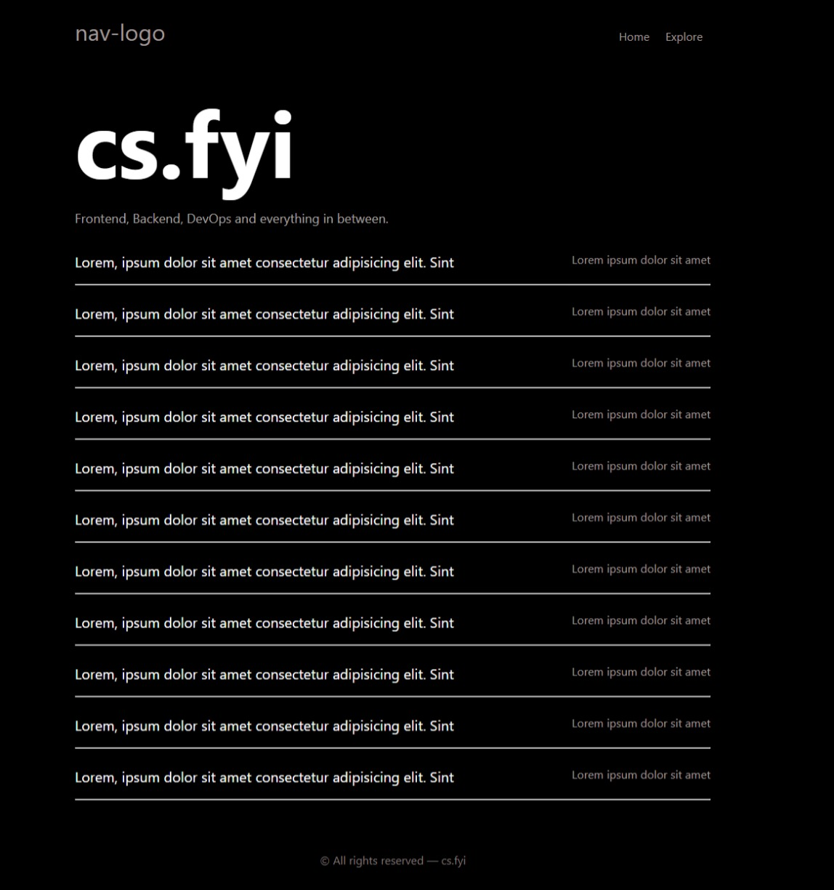

# FYI-Clone

This project is an activity to replicate all of the pages on cs.fyi, serving as an exercise to solidify knowledge in HTML and CSS.

## Overview

For more details on similar activities, you can visit [Roadmap.sh](https://roadmap.sh) and explore different roadmaps. This particular activity is located on the Fullstack Roadmap under the HTML & CSS checkpoint.

Visit the Fullstack Roadmap [here](https://roadmap.sh/full-stack).

The source code for this project was crafted using HTML and CSS only.

## Live Demo

Explore the live demo [here](https://frogerall.github.io/fyi-clone).

## Contact

For suggestions, comments, or collaboration, feel free to reach out via email:

Email: saliticoadrian@gmail.com

Thanks for checking it out! 🙌
Frontend, Backend, DevOps, and everything in between.
